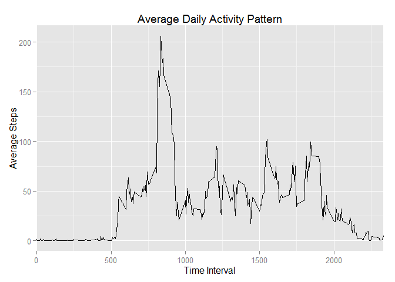
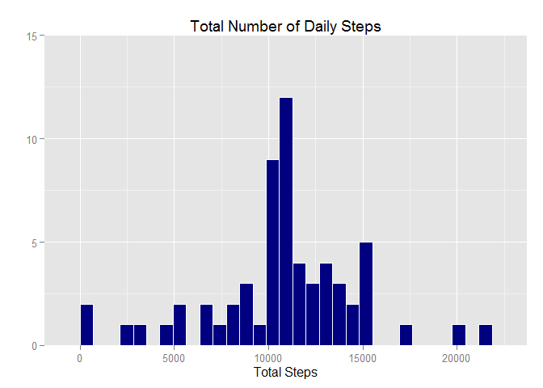
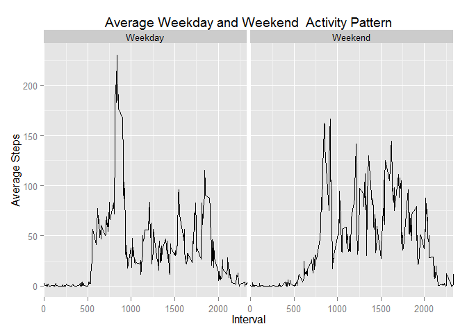

# Reproducible Research: Peer Assessment 1

We begin by loading the data into a data frame and converting the date column to an object of class date.


```r
Activity <- read.csv("activity.csv")
Activity$date <- as.Date(Activity$date, format = "%Y-%m-%d")
```

To determine the total number of steps taken each day we aggregate the data by the day and sum the aggregated data, removing the NA values. This data is then plotted via ggplot.


```r
DailySteps <- na.omit(aggregate(Activity$steps, list(Date = Activity$date), sum))

library(ggplot2)

ggplot(DailySteps, aes(x = x)) + geom_histogram(color = "white", fill = "navy") + xlab("Total Steps") + ylab("") + coord_cartesian(ylim = c(0,10)) + ggtitle("Total Number of Daily Steps")
```

```
## stat_bin: binwidth defaulted to range/30. Use 'binwidth = x' to adjust this.
```

 

To calculate the average number of total steps taken each day we simply take the mean of the steps column in the aggregated data frame just created.


```r
mean(DailySteps$x)
```

```
## [1] 10766
```

The median is calculated analogously.


```r
median(DailySteps$x)
```

```
## [1] 10765
```

To determine the daily activity pattern we again aggregate the data. However, this time we aggregate by the interval column, take the mean of this aggregated data removing NA values and use ggplot to create the time series plot.


```r
DailyActivityPattern <- aggregate(Activity$steps, list(Interval = Activity$interval), mean, na.rm = TRUE)

ggplot(DailyActivityPattern, aes(x = Interval, y = x)) + geom_line() + xlab("Time Interval") + ylab("Average Steps") + coord_cartesian(xlim = c(0, 2335)) + ggtitle("Average Daily Activity Pattern")
```

 

The maximum average steps taken during any interval is determined by calling the max() function on the column containing the average number of steps in the aggregated data frame.


```r
max(DailyActivityPattern$x)
```

```
## [1] 206.2
```

The total number of NA's contained in the steps column of our data set is determined by summing over a logical vector determining which steps data are NA.


```r
sum(is.na(Activity$steps))
```

```
## [1] 2304
```

We now turn to imputing these missing values. Here the strategy employed is to replace the NA values with the average number of steps taken during the interval in which the NA occurs.


```r
ImputedActivity <- Activity

for(i in 1:nrow(ImputedActivity))
{
     if(is.na(ImputedActivity[i,1]) == TRUE)
     {
          k <- ImputedActivity[i,3]
          ImputedActivity[i,1] <- DailyActivityPattern[DailyActivityPattern$Interval == k, 2]
     }
}
```

Confirmation that all NA values have been removed.


```r
sum(is.na(ImputedActivity$steps))
```

```
## [1] 0
```

The histogram showing the total number of daily steps using the imputed data is plotted the same way as before with the exception that NA values do not need to be removed.


```r
ImputedDailySteps <- aggregate(ImputedActivity$steps, list(Date = ImputedActivity$date), sum)

ggplot(ImputedDailySteps, aes(x = x)) + geom_histogram(color = "white", fill = "navy") + xlab("Total Steps") + ylab("") + coord_cartesian(ylim = c(0,15)) + ggtitle("Total Number of Daily Steps")
```

```
## stat_bin: binwidth defaulted to range/30. Use 'binwidth = x' to adjust this.
```

 

The mean and median for the imputed data are also calculated the same way.


```r
mean(ImputedDailySteps$x)
```

```
## [1] 10766
```

median

```r
median(ImputedDailySteps$x)
```

```
## [1] 10766
```

The mean for the imputed data and the initial data are the same while the medians differ by 1. The two histograms are very similar with the exception for the counts around the average where there is a significantly higher number of counts for the imputed data. This is to be expected since the NA values were replaced with the average number of steps for the same time interval. 

To analyze the average steps taken for each interval split by weekdays and weekends we create a new column in the imputed data which marks whether or not that is a weekday (i.e. Monday-Friday) or a weekend. This was achieved by first determing the day of each date by extracting the weekday from the date into a "Day" column using the weekdays() function. The weekday was then converted to either "Weekend" if the "Day" column value was "Saturday" or "Sunday" and was set to "Weekday" otherwise. The data was aggregated by both the day and interval and the steps averaged. Finally the data was split between two plots based on the day.


```r
ImputedActivity$Day <- weekdays(ImputedActivity$date)

for(i in 1:nrow(ImputedActivity))
{
     if(ImputedActivity$Day[i] == "Saturday" | ImputedActivity$Day[i] == "Sunday")
     {
          ImputedActivity$Day[i] = "Weekend" 
     }
     
     else
     {
          ImputedActivity$Day[i] = "Weekday"
     }
}

ImputedMean <- aggregate(steps ~ Day + interval, data = ImputedActivity, mean)

ggplot(ImputedMean, aes(x = interval, y = steps)) + geom_line() + facet_grid(. ~ Day) + xlab("Interval") + ylab("Average Steps") + coord_cartesian(xlim = c(0, 2335)) + ggtitle("Average Weekday and Weekend  Activity Pattern")
```

 
